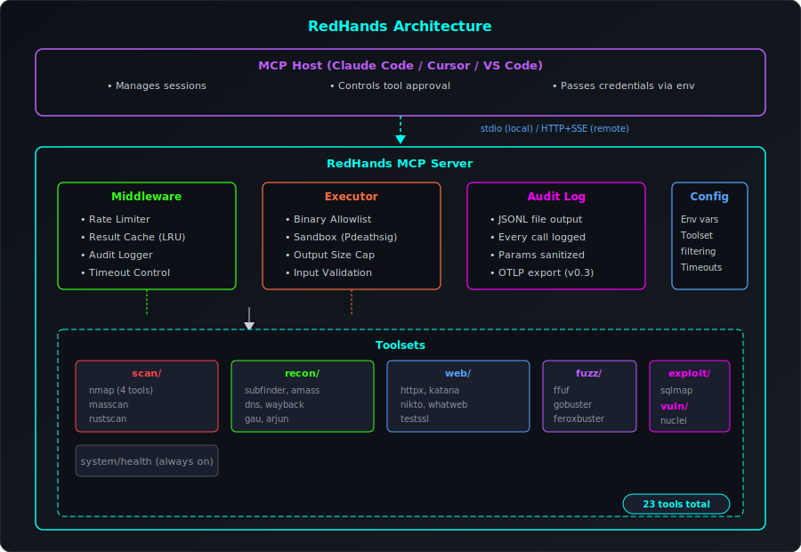
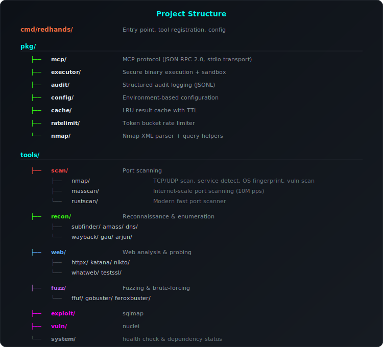
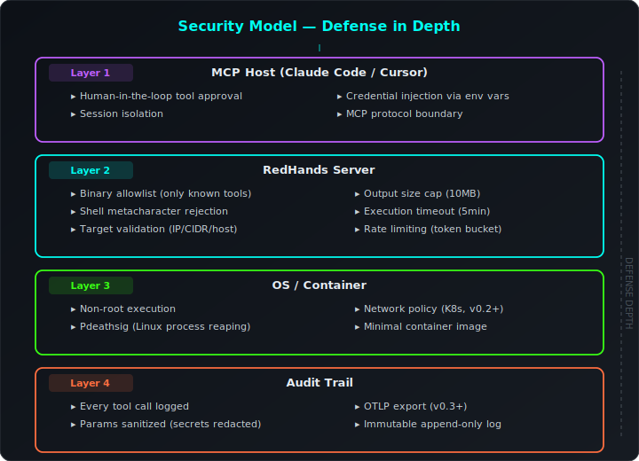

# RedHands — Product Requirements Document

## Overview

RedHands is an MCP (Model Context Protocol) server that exposes offensive security tools to AI agents. It follows the same architecture patterns used by GitHub's MCP server and Atlassian's MCP server — a single-binary Go server with zero external dependencies, multi-transport support (stdio/SSE/WebSocket), tool chaining, structured output parsing, report generation, and a JSON plugin system.

**Current state:** v0.2.0 — 125 tools across 15 toolsets, multi-transport (stdio/SSE/WebSocket), authentication (API key/mTLS), workflow engine, structured parsers, report generation, plugin system, Docker image with all tools pre-installed.

---

## Design Principles

1. **One server, many tools** — A single `redhands` binary covers all offensive security tooling (like GitHub covers all of GitHub's API surface in one server)
2. **Toolsets for filtering** — Tools grouped by domain; users enable only what they need via `--toolsets` or env vars
3. **Zero external dependencies** — Pure Go stdlib implementation for maximum portability and minimal attack surface
4. **Auth lives outside** — MCP hosts (Claude Code, Cursor, VS Code) manage credentials; RedHands accepts config via env vars, not custom RBAC
5. **Multi-transport** — Stdio for local dev, SSE/WebSocket for remote/team deployment
6. **Observability built-in** — Every tool call is audit-logged; structured output parsing for downstream consumption
7. **Safe by default** — Allowlisted binaries, input validation, output caps, rate limiting, authentication
8. **Extensible without code** — JSON plugin definitions for custom tool wrappers

---

## Target Users

| User | Use Case |
|------|----------|
| Pentest teams | AI-assisted recon, scanning, vuln assessment, AD attacks via Claude/Cursor |
| Security engineers | Automated security workflows triggered by AI agents |
| Red team operators | AI-augmented offensive operations with full audit trail |
| DevSecOps | Integrate security scanning into AI-powered CI/CD pipelines |
| Purple teams | Network analysis and incident investigation with tshark/packet tools |

---

## Architecture

  

### Directory Layout

  

---

## Toolsets & Tools (125 total)

### Toolset: `nmap` — Nmap Suite (4 tools)

| Tool | Binary | Description |
|------|--------|-------------|
| `nmap_port_scan` | nmap | TCP/UDP port scanning (SYN, connect, UDP) |
| `nmap_service_detect` | nmap | Service and version detection (-sV) |
| `nmap_os_detect` | nmap | OS fingerprinting (-O) |
| `nmap_vuln_scan` | nmap | NSE vulnerability scripts |

### Toolset: `scan` — Port Scanning (2 tools)

| Tool | Binary | Description |
|------|--------|-------------|
| `masscan_scan` | masscan | Internet-scale port scanning (10M pps) |
| `rustscan_scan` | rustscan | Modern fast port scanner (all 65535 ports) |

### Toolset: `recon` — Reconnaissance & Enumeration (6 tools)

| Tool | Binary | Description |
|------|--------|-------------|
| `subfinder_enum` | subfinder | Passive subdomain enumeration |
| `amass_enum` | amass | Network mapping and ASN discovery |
| `dns_lookup` | dig | DNS record queries (A, AAAA, MX, NS, TXT, etc.) |
| `waybackurls` | waybackurls | Fetch archived URLs from the Wayback Machine |
| `gau_urls` | gau | Fetch URLs from AlienVault OTX, Wayback, CommonCrawl, URLScan |
| `arjun_discover` | arjun | HTTP parameter discovery (hidden GET/POST params) |

### Toolset: `web` — Web Analysis & Probing (5 tools)

| Tool | Binary | Description |
|------|--------|-------------|
| `httpx_probe` | httpx | HTTP service probing with tech detection |
| `katana_crawl` | katana | Next-gen web crawler (JS crawling, headless) |
| `nikto_scan` | nikto | Web server vulnerability scanner |
| `whatweb_fingerprint` | whatweb | Web technology fingerprinting |
| `testssl_scan` | testssl.sh | TLS/SSL encryption testing |

### Toolset: `fuzz` — Fuzzing & Brute-forcing (3 tools)

| Tool | Binary | Description |
|------|--------|-------------|
| `ffuf_fuzz` | ffuf | Web fuzzing (dirs, params, vhosts) |
| `gobuster_dir` | gobuster | Directory/file brute-forcing |
| `feroxbuster_scan` | feroxbuster | Recursive content discovery (forced browsing) |

### Toolset: `exploit` — Exploitation (1 tool)

| Tool | Binary | Description |
|------|--------|-------------|
| `sqlmap_scan` | sqlmap | Automatic SQL injection detection and exploitation |

### Toolset: `vuln` — Vulnerability Scanning (1 tool)

| Tool | Binary | Description |
|------|--------|-------------|
| `nuclei_scan` | nuclei | Template-based vulnerability scanning |

### Toolset: `impacket` — Active Directory / SMB (8 tools)

| Tool | Binary | Description |
|------|--------|-------------|
| `impacket_secretsdump` | impacket-secretsdump | Dump SAM/LSA/NTDS.dit secrets |
| `impacket_psexec` | impacket-psexec | PsExec-style remote execution |
| `impacket_wmiexec` | impacket-wmiexec | WMI-based remote execution |
| `impacket_smbclient` | impacket-smbclient | SMB client operations |
| `impacket_dcomexec` | impacket-dcomexec | DCOM remote execution |
| `impacket_get_tgt` | impacket-getTGT | Request Kerberos TGT |
| `impacket_get_st` | impacket-getST | Request service ticket (Kerberoast/delegation) |
| `impacket_ntlmrelay` | impacket-ntlmrelayx | NTLM relay attack |

### Toolset: `sliver` — Sliver C2 Framework (9 tools)

| Tool | Binary | Description |
|------|--------|-------------|
| `sliver_generate` | sliver-client | Generate implant (mTLS, HTTP/S, DNS, WireGuard) |
| `sliver_listeners` | sliver-client | Manage C2 listeners |
| `sliver_sessions` | sliver-client | List/interact with sessions |
| `sliver_beacons` | sliver-client | List/interact with beacons |
| `sliver_execute` | sliver-client | Execute commands on implant |
| `sliver_upload` | sliver-client | Upload files to implant |
| `sliver_download` | sliver-client | Download files from implant |
| `sliver_pivot` | sliver-client | Pivot setup and management |
| `sliver_portfwd` | sliver-client | Port forwarding through implant |

### Toolset: `tunnel` — Network Tunneling (5 tools)

| Tool | Binary | Description |
|------|--------|-------------|
| `chisel_server` | chisel | Start reverse tunnel endpoint |
| `chisel_client` | chisel | Connect client (forward/reverse/SOCKS) |
| `ligolo_start` | ligolo-proxy | Start Ligolo-ng proxy server |
| `ligolo_route` | ligolo-proxy | Add routes through tunnel |
| `ligolo_listener` | ligolo-proxy | Manage listeners on agent |

### Toolset: `crack` — Password Cracking (6 tools)

| Tool | Binary | Description |
|------|--------|-------------|
| `hashcat_crack` | hashcat | Crack hashes (dictionary, rules, masks) |
| `hashcat_benchmark` | hashcat | Benchmark hash types |
| `hashcat_show` | hashcat | Show cracked from potfile |
| `john_crack` | john | Crack passwords with John the Ripper |
| `john_show` | john | Show cracked passwords |
| `john_formats` | john | List supported hash formats |

### Toolset: `crackmapexec` — Network Protocol Attacks (5 tools)

| Tool | Binary | Description |
|------|--------|-------------|
| `cme_smb` | crackmapexec | SMB enumeration/exec/pass-the-hash |
| `cme_winrm` | crackmapexec | WinRM execution |
| `cme_ldap` | crackmapexec | LDAP enumeration |
| `cme_mssql` | crackmapexec | MSSQL queries/execution |
| `cme_ssh` | crackmapexec | SSH credential spray/exec |

### Toolset: `certipy` — AD Certificate Services (6 tools)

| Tool | Binary | Description |
|------|--------|-------------|
| `certipy_find` | certipy | Find AD CS templates and CAs |
| `certipy_req` | certipy | Request certificates |
| `certipy_auth` | certipy | Authenticate via PKINIT |
| `certipy_shadow` | certipy | Shadow credentials attack |
| `certipy_forge` | certipy | Golden certificate forgery |
| `certipy_relay` | certipy | NTLM relay to AD CS |

### Toolset: `tshark` — Packet Analysis (5 tools)

| Tool | Binary | Description |
|------|--------|-------------|
| `tshark_capture` | tshark | Capture packets (interface, filter, duration) |
| `tshark_read` | tshark | Read pcap with display filter |
| `tshark_stats` | tshark | Protocol statistics |
| `tshark_extract` | tshark | Extract fields from captures |
| `tshark_follow` | tshark | Follow TCP/UDP/HTTP streams |

### Toolset: `kubedagger` — Kubernetes Offensive (57 tools)

| Tool | Binary | Description |
|------|--------|-------------|
| 57 eBPF-powered tools | kubedagger | Container escape, syscall hooking, network sniffing, process hiding, crypto mining, rootkit deployment, and more |

### System (always enabled, 1 tool)

| Tool | Binary | Description |
|------|--------|-------------|
| `redhands_health` | — | Server health check and binary dependency status |

### Default Toolsets

When `REDHANDS_TOOLSETS` is unset: all toolsets are enabled.

---

## Infrastructure

### Transports

| Transport | Protocol | Use Case |
|-----------|----------|----------|
| stdio (default) | Line-delimited JSON-RPC | Local dev with Claude Code/Cursor/VS Code |
| SSE | HTTP + Server-Sent Events | Remote/team deployment, multiple clients |
| WebSocket | Raw frames (stdlib, no deps) | Real-time bidirectional communication |

### Authentication

| Mode | Mechanism | Use Case |
|------|-----------|----------|
| none (default) | — | Local stdio usage |
| apikey | `X-API-Key` header | Simple shared-secret for SSE/WS |
| mtls | Client certificate verification | Zero-trust deployments |

### Tool Chaining / Workflow Engine

Sequential tool execution with variable substitution:
- `$prev.text` — previous step's text output
- `$step[N].text` — Nth step's text output
- Early abort on error
- Combined results from all steps

### Structured Output Parsing

Built-in parsers registered via `pkg/parser/`:
- **NmapXML** — hosts, ports, services, scripts
- **NucleiJSON** — findings grouped by severity
- **MasscanJSON** — host/port pairs

### Report Generation

- **Markdown** — structured `.md` reports
- **HTML** — self-contained with inline CSS, no external resources

### Plugin System

JSON tool definitions loaded from `REDHANDS_PLUGINS_DIR`:
- `text/template` arg substitution
- Implements `mcp.Tool` interface
- Input validation inherited from executor sandbox
- Hot-reload on server startup

---

## Configuration Reference

All configuration via environment variables (`REDHANDS_*` prefix):

| Variable | Default | Description |
|----------|---------|-------------|
| `REDHANDS_TOOLSETS` | (all) | Comma-separated toolsets to enable |
| `REDHANDS_TIMEOUT` | `5m` | Execution timeout per tool call |
| `REDHANDS_MAX_OUTPUT` | `10485760` | Max output bytes per execution (10MB) |
| `REDHANDS_RATE_LIMIT` | `10` | Token bucket refill rate (requests/sec) |
| `REDHANDS_RATE_BURST` | `20` | Token bucket burst capacity |
| `REDHANDS_CACHE_TTL` | `5m` | Result cache TTL |
| `REDHANDS_CACHE_SIZE` | `100` | Max cached results (LRU eviction) |
| `REDHANDS_AUDIT_FILE` | `audit.jsonl` | Audit log file path |
| `REDHANDS_TRANSPORT` | `stdio` | Transport: `stdio`, `sse`, or `ws` |
| `REDHANDS_SSE_ADDR` | `:8080` | SSE HTTP listen address |
| `REDHANDS_WS_ADDR` | `:8081` | WebSocket listen address |
| `REDHANDS_AUTH` | `none` | Auth mode: `none`, `apikey`, or `mtls` |
| `REDHANDS_API_KEY` | — | API key (required when auth=apikey) |
| `REDHANDS_TLS_CERT` | — | TLS certificate path |
| `REDHANDS_TLS_KEY` | — | TLS private key path |
| `REDHANDS_TLS_CA` | — | CA cert for mTLS client verification |
| `REDHANDS_PLUGINS_DIR` | `./plugins` | Directory for JSON plugin definitions |

---

## Release History

### v0.2.0 — Full Arsenal (current)

- **7 new toolsets**: Impacket (8 tools), Sliver C2 (9), Chisel/Ligolo tunneling (5), Hashcat/John cracking (6), CrackMapExec (5), Certipy AD CS (6), tshark packet analysis (5)
- **Multi-transport**: SSE (stdlib net/http) and WebSocket (raw frame protocol, stdlib crypto/sha1)
- **Authentication**: API key (`X-API-Key` header) and mTLS (client cert verification)
- **Workflow engine**: Sequential tool chaining with `$prev.text` / `$step[N].text` variable substitution
- **Structured parsers**: Nmap XML, Nuclei JSON, Masscan JSON
- **Report generation**: Markdown and self-contained HTML formats
- **Plugin system**: JSON tool definitions with `text/template` arg substitution
- **Docker image**: Multi-stage build with all security tools pre-installed
- **Unit tests**: Full coverage across all new toolsets and infrastructure packages
- **125 tools** across 15 toolsets + system health

### v0.1.0 — First Release

- MCP protocol core (JSON-RPC 2.0, stdio transport)
- 23 tools across 7 toolsets (nmap, scan, recon, web, fuzz, exploit, vuln) + system
- Category-based directory layout (tools organized by domain)
- Secure binary execution with allowlist + sandbox
- Structured audit logging (JSONL)
- Input validation and shell metacharacter rejection
- Toolset filtering via `REDHANDS_TOOLSETS` env var
- Token bucket rate limiting middleware
- LRU result cache with TTL
- Binary auto-discovery

---

## Release Plan

### v0.3.0 — Observability & Deployment (Next)

**Goal:** Production-ready deployment with full observability.

| Deliverable | Details |
|-------------|---------|
| OpenTelemetry | OTLP export for traces and metrics |
| Structured logging | slog with JSON output, configurable level |
| Metrics | Tool call count, duration histogram, error rate |
| Helm chart | Kubernetes deployment with configurable resources |
| Health endpoint | `GET /health` for load balancers (SSE/WS modes) |

### v0.4.0 — Advanced Features

**Goal:** Intelligent workflow support and expanded coverage.

| Deliverable | Details |
|-------------|---------|
| Workflow hints | Tool descriptions that guide AI agents to chain tools logically |
| Finding dedup | Cross-tool finding deduplication |
| Conditional workflows | Branching based on step results |
| Additional tools | BloodHound, Responder, Evil-WinRM, Rubeus per user demand |

---

## Non-Goals (Explicit)

| Not building | Reason |
|--------------|--------|
| Custom RBAC/permissions | MCP hosts control tool approval; adding our own layer adds friction without value |
| Multi-tenancy in the server | Deploy separate instances per team; simpler, more isolated |
| Web UI / dashboard | The AI agent IS the UI; audit logs feed into existing SIEM/Grafana |
| External dependencies | Stdlib-only policy keeps the binary portable and the supply chain minimal |
| Database persistence | Audit logs go to files/OTLP; findings returned to the agent directly |
| PDF reports | Would require external dep (wkhtmltopdf); users convert HTML→PDF externally |

---

## Security Model

  

### Defense in Depth

1. **Transport layer** — mTLS for zero-trust, API key for simple shared-secret
2. **Input validation** — Shell metacharacter rejection on all string parameters
3. **Binary allowlist** — Only explicitly configured security tools can be executed
4. **Sandbox** — Execution timeout, output size cap, controlled argument construction
5. **Rate limiting** — Token bucket prevents abuse and runaway tool calls
6. **Audit logging** — Every invocation logged with full parameters and results

---

## Success Metrics

| Metric | Target |
|--------|--------|
| Tool call latency (overhead) | <50ms added beyond tool execution time |
| Concurrent scans supported | 10+ simultaneous without degradation |
| Binary startup time | <100ms to first `tools/list` response |
| Test coverage | >80% on pkg/ packages |
| Supported tools | 125 shipped (v0.2.0), expanding |
| Container image size | <500MB with all tools installed |
| Zero external Go dependencies | Maintained across all releases |

---

## Competitive Landscape

| Project | Scope | Difference from RedHands |
|---------|-------|--------------------------|
| GitHub MCP Server | GitHub API | Different domain; same architecture pattern |
| mcp-atlassian | Jira/Confluence | Different domain; Python, similar patterns |
| PentestGPT | AI pentesting | Monolithic, no MCP, not composable |
| HackerGPT | AI security chat | Chat-only, no tool protocol |
| RedHands | Security tool MCP | Standardized MCP protocol, composable with any AI agent, 125 tools |

RedHands is the first production-grade MCP server purpose-built for offensive security tooling.
